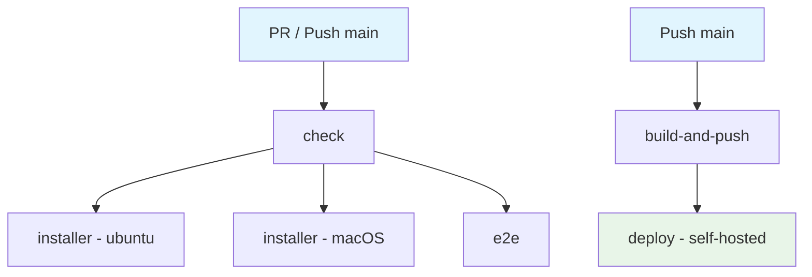
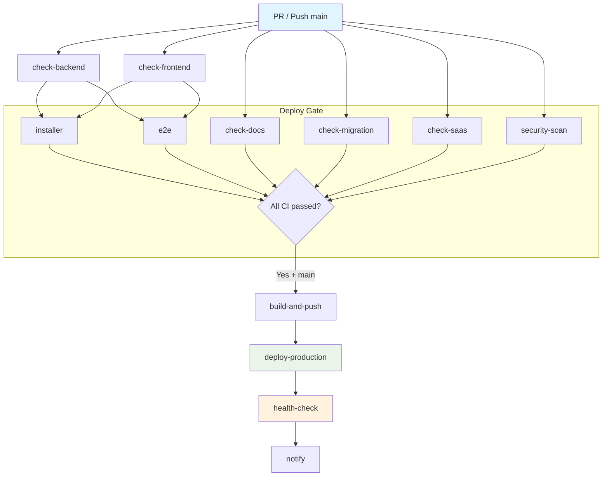

# CI/CD Workflow Audit & Enhancement Report

**Date:** 2026-03-17
**Branch:** develop
**Workflows analyzed:** `ci.yml`, `deploy.yml`

---

## 1. Current Architecture Overview

```
Workflows:
├── ci.yml          # CI pipeline (PR + push to main)
│   ├── check       # Lint, typecheck, test, coverage, build, migration gates
│   ├── installer   # Smoke tests (docker + local mode) on ubuntu + macOS
│   └── e2e         # Cypress E2E tests
└── deploy.yml      # CD pipeline (push to main only)
    ├── build-and-push  # Docker build → GHCR
    └── deploy          # Self-hosted runner → docker compose rolling restart
```



---

## 2. Best Practices Assessment

### What's Already Good

| Area | Detail | Rating |
|------|--------|--------|
| Concurrency control | `cancel-in-progress: true` on CI, `false` on deploy | GOOD |
| Permissions | Least-privilege `contents: read` on CI | GOOD |
| Caching | uv, npm, Next.js build cache all configured | GOOD |
| Postgres service | Health checks with retries | GOOD |
| Migration gates | One-migration-per-PR + integrity check (up/down/up) | EXCELLENT |
| SaaS hardening | Dedicated gate step | GOOD |
| Docker build | Buildx + GHA cache (mode=max) | GOOD |
| Deploy concurrency | `cancel-in-progress: false` prevents partial deploys | GOOD |
| Artifact upload | Coverage + Cypress artifacts on failure | GOOD |
| Installer testing | Multi-OS matrix (ubuntu + macOS), multiple modes | EXCELLENT |

---

## 3. Issues Found

### CRITICAL

| # | Issue | Impact | Location |
|---|-------|--------|----------|
| C1 | **Single monolithic `check` job** — lint, typecheck, test, build all sequential in 1 job | CI time bloated; single failure blocks all feedback | `ci.yml:17` |
| C2 | **No CI gate before deploy** — `deploy.yml` triggers on `push: main` independently, no `needs: ci` | Broken code can deploy if CI is still running | `deploy.yml:3-5` |
| C3 | **Deploy health check is `sleep 10`** — no actual HTTP health probe | Silent deploy failures in production | `deploy.yml:114` |
| C4 | **Secrets in docker login command** — `${{ secrets.GITHUB_TOKEN }}` in `run:` block | Token visible in logs if `set -x` enabled | `deploy.yml:102` |

### HIGH

| # | Issue | Impact | Location |
|---|-------|--------|----------|
| H1 | **E2E runs without backend** — starts frontend dev server only, no backend service | E2E tests can't test real API flows | `ci.yml:381-394` |
| H2 | **No dependency pinning for Cypress** — installed via `make frontend-sync` (npm install) | Potentially non-reproducible E2E | `ci.yml:369` |
| H3 | **npm used instead of pnpm** — README says `pnpm dev`, but CI uses `npm install` and `package-lock.json` | Lock file mismatch risk | `ci.yml:62, Makefile` |
| H4 | **No timeout on jobs** — all jobs use default 6h timeout | Hung jobs waste runner minutes | All jobs |
| H5 | **`latest` tag on Docker images** — mutable tag, no immutable version pinning | Rollback ambiguity, cache poisoning risk | `deploy.yml:63,85` |

### MEDIUM

| # | Issue | Impact | Location |
|---|-------|--------|----------|
| M1 | **No security scanning** — no SAST, dependency audit, or container scan | Vulnerabilities undetected | Missing |
| M2 | **No PR status checks enforcement** — no branch protection rules referenced | PRs can merge without passing CI | Missing |
| M3 | **Coverage scope too narrow** — only 2 modules at 100%, no overall threshold | Low overall coverage not caught | `Makefile:94-101` |
| M4 | **No Playwright/Cypress caching** — browser binaries downloaded every run | Slow E2E setup | `ci.yml:360-413` |
| M5 | **Frontend format check not in CI** — `backend-lint` includes format check, frontend doesn't | Inconsistent formatting can merge | `ci.yml:151` |
| M6 | **No rollback mechanism** — deploy is forward-only | Recovery requires manual intervention | `deploy.yml` |
| M7 | **Hardcoded image paths** — `ghcr.io/phamty2002z/flowgrid-*` | Not portable across forks | `deploy.yml:28-29` |

### LOW

| # | Issue | Impact | Location |
|---|-------|--------|----------|
| L1 | No deploy notifications (Slack/Discord/email) | Team unaware of deploy status | Missing |
| L2 | No workflow_call reuse — each workflow is standalone | Duplication of setup steps | Both files |
| L3 | Blank lines at `ci.yml:79-80` and `ci.yml:155` | Minor lint issue | `ci.yml` |

---

## 4. Enhancement Proposals

### P1: Split `check` into Parallel Jobs (CRITICAL)

**Current:** 1 monolithic job (~15-20 min estimated)
**Proposed:**

```
check-backend:   lint + typecheck + coverage        (~5 min)
check-frontend:  lint + typecheck + test + build     (~5 min)
check-docs:      docs-check                          (~1 min)
check-migration: migration gates (PR only)           (~3 min)
check-saas:      SaaS hardening gates                (~2 min)
```

**Benefit:** ~60% faster CI, granular failure feedback

### P2: Gate Deploy on CI Success (CRITICAL)

```yaml
# deploy.yml
on:
  workflow_run:
    workflows: ["CI"]
    types: [completed]
    branches: [main]

jobs:
  build-and-push:
    if: ${{ github.event.workflow_run.conclusion == 'success' }}
```

**Alternative:** Use `workflow_call` — CI calls deploy as reusable workflow.

### P3: Add Real Health Checks to Deploy (CRITICAL)

Replace `sleep 10` with:
```yaml
- name: Verify deployment health
  run: |
    for i in $(seq 1 30); do
      if curl -fsS http://localhost:8000/healthz; then exit 0; fi
      sleep 5
    done
    echo "Health check failed"
    exit 1
```

### P4: Add Security Scanning (HIGH)

```yaml
security:
  runs-on: ubuntu-latest
  steps:
    - uses: actions/checkout@v4
    - name: Python dependency audit
      run: cd backend && uv run pip-audit
    - name: npm audit
      run: cd frontend && npm audit --audit-level=high
    - name: Trivy container scan
      uses: aquasecurity/trivy-action@master
      with:
        scan-type: 'fs'
        severity: 'CRITICAL,HIGH'
```

### P5: Add Job Timeouts (HIGH)

```yaml
jobs:
  check-backend:
    timeout-minutes: 15
  check-frontend:
    timeout-minutes: 15
  installer:
    timeout-minutes: 20
  e2e:
    timeout-minutes: 15
  build-and-push:
    timeout-minutes: 15
  deploy:
    timeout-minutes: 10
```

### P6: Use Dynamic Image Tags (MEDIUM)

Replace hardcoded image paths:
```yaml
env:
  BACKEND_IMAGE: ${{ env.REGISTRY }}/${{ github.repository }}-backend
  FRONTEND_IMAGE: ${{ env.REGISTRY }}/${{ github.repository }}-frontend
```

### P7: Add Deploy Notifications (LOW)

```yaml
- name: Notify deploy status
  if: always()
  uses: slackapi/slack-github-action@v2
  with:
    payload: |
      {"text": "Deploy ${{ job.status }}: ${{ needs.build-and-push.outputs.image_tag }}"}
```

### P8: Resolve npm vs pnpm Inconsistency (HIGH)

Either:
- Switch CI to `pnpm` (align with README)
- Or update README to `npm` (align with CI)

Current mismatch: `package-lock.json` in CI vs `pnpm` in project config.

---

## 5. Priority Roadmap

| Phase | Items | Effort | Impact |
|-------|-------|--------|--------|
| **Phase 1 - Quick Wins** | H4 (timeouts), M5 (format check), L3 (blank lines), C4 (login action) | 1h | Medium |
| **Phase 2 - CI Parallelization** | P1 (split jobs), H8 (npm/pnpm) | 3h | High |
| **Phase 3 - Deploy Safety** | C2 (gate deploy), C3 (health checks), M6 (rollback) | 2h | Critical |
| **Phase 4 - Security** | P4 (scanning), H5 (remove latest tag) | 2h | High |
| **Phase 5 - DX Polish** | L1 (notifications), L2 (reusable workflows), M4 (cypress cache) | 3h | Low-Medium |

---

## 6. Proposed Enhanced CI Architecture



---

## 7. Unresolved Questions

1. **npm vs pnpm** — which is the canonical package manager? CI uses npm but project has pnpm config
2. **E2E scope** — are current E2E tests frontend-only by design, or should backend be included?
3. **Staging environment** — is there a plan for staging deploy before production?
4. **Branch protection** — are GitHub branch protection rules configured for `main`?
5. **Self-hosted runner** — is the deploy runner properly secured and maintained?
