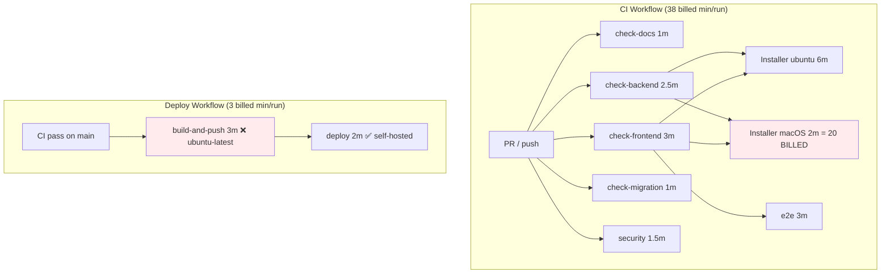
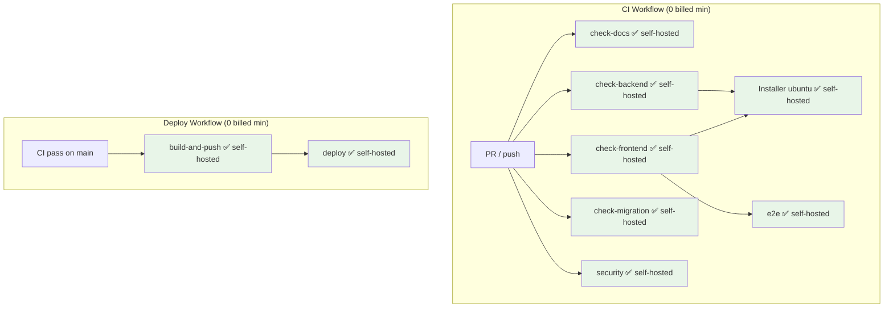
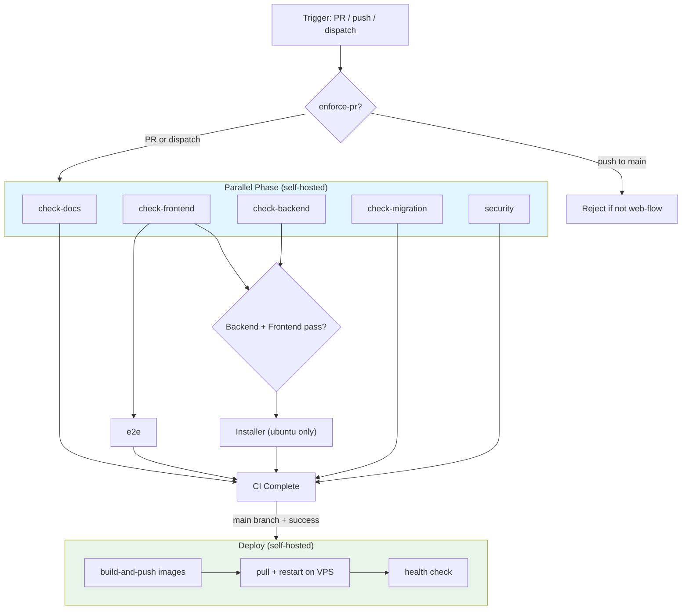

## Problem Statement

**GitHub Actions quota**: 2,000 min/month. Current usage: **1,802 min (90%)** mid-cycle.

**Root cause**: Every CI run bills ~38 min, with **macOS Installer test alone costing ~20 billed min** (2 min wall * 10x macOS multiplier). Today (Mar 17) consumed ~380 min across ~10 runs.

**Solution**: Migrate CI to self-hosted runner on existing VPS (4 vCPU, 8GB RAM) → **0 billed minutes** for CI + Deploy.

## Current Architecture

### Minutes Breakdown Per CI Run

| Job | OS | Wall Time | Multiplier | Billed Min |
|-----|----|-----------|------------|------------|
| check-docs | ubuntu-latest | 1m | 1x | 1 |
| check-frontend | ubuntu-latest | 3m | 1x | 3 |
| check-backend | ubuntu-latest | 2.5m | 1x | 2.5 |
| check-migration | ubuntu-latest | 1m | 1x | 1 |
| security | ubuntu-latest | 1.5m | 1x | 1.5 |
| Installer (ubuntu) | ubuntu-latest | 6m | 1x | 6 |
| **Installer (macOS)** | **macos-latest** | **2m** | **10x** | **20** |
| e2e | ubuntu-latest | 3m | 1x | 3 |
| **Total** | | **20m wall** | | **~38m billed** |

### Per Merge Cycle Cost

| Phase | Billed Minutes |
|-------|---------------|
| CI on PR | 38 |
| CI on main (push) | 38 |
| Deploy build-and-push | 3 |
| **Total per merge** | **~79** |

## Target Architecture

## Execution Flow Diagram

## Changes Required

### 1. Install GitHub Actions Self-Hosted Runner on VPS

**Server**: 192.168.1.5 (4 vCPU, 8GB RAM, Ubuntu)

**Prerequisites to install on VPS**:
- GitHub Actions runner agent
- Docker + Docker Compose (already installed)
- Node.js 22 (for frontend checks)
- Python 3.12 + uv (for backend checks)
- PostgreSQL client (for migration checks)
- Trivy (for security scanning)
- Cypress system dependencies (for e2e)

**Runner labels**: `self-hosted`, `linux`, `x64`

### 2. CI Workflow Changes

| Change | Before | After | Impact |
|--------|--------|-------|--------|
| All CI jobs `runs-on` | `ubuntu-latest` | `self-hosted` | -18 billed min/run |
| macOS Installer | runs every CI | **remove entirely** | -20 billed min/run |
| Deploy build-and-push | `ubuntu-latest` | `self-hosted` | -3 billed min/deploy |
| **Total savings** | ~38 min/run | **0 min/run** | **100% reduction** |

### 3. Remove macOS Installer Test

**Rationale**: The macOS installer test alone costs 20 billed min per run (10x multiplier). The installer is a bash script — if it works on Linux, it works on macOS. The macOS-specific test (brew install postgres, local mode) provides low value vs. its cost.

**Alternative**: Run macOS installer test manually via `workflow_dispatch` when installer changes.

### 4. Path Filtering (Bonus Optimization)

Skip irrelevant jobs based on changed files:

| Job | Only run when |
|-----|--------------|
| check-backend | `backend/**`, `Makefile`, `scripts/**` change |
| check-frontend | `frontend/**`, `Makefile` change |
| check-docs | `docs/**`, `*.md` change |
| check-migration | `backend/models/**`, `backend/migrations/**` change |
| security | always (security is cheap) |
| e2e | `frontend/**` change |
| Installer | `install.sh`, `compose*.yml`, `Dockerfile*` change |

## Requirements Matrix

### Functional Requirements

| ID | Requirement | Priority | Acceptance Criteria |
|----|-------------|----------|-------------------|
| REQ-001 | Self-hosted runner handles all CI jobs | High | All 7 CI jobs pass on self-hosted |
| REQ-002 | Remove macOS Installer from auto-CI | High | macOS job removed from ci.yml |
| REQ-003 | Deploy build-and-push runs on self-hosted | High | Docker images built and pushed from VPS |
| REQ-004 | Path filtering reduces unnecessary runs | Medium | Jobs skip when irrelevant files change |
| REQ-005 | CI still blocks PR merge on failure | High | Branch protection rules unchanged |

### Security Requirements

| ID | Requirement | Constraint |
|----|-------------|-----------|
| SEC-001 | Runner token stored securely | Use GitHub runner registration token, not PAT |
| SEC-002 | Runner runs as non-root | Dedicated `github-runner` user |
| SEC-003 | Runner workspace isolated from prod | Separate directory from /opt/projects |
| SEC-004 | Docker socket access controlled | Runner user in docker group (already needed for deploy) |

### Performance Requirements

| ID | Metric | Target | Current |
|----|--------|--------|---------|
| PERF-001 | Billed minutes per CI run | 0 | ~38 |
| PERF-002 | Billed minutes per month | <100 | ~1,802 |
| PERF-003 | CI wall time | <12 min | ~9 min |
| PERF-004 | Concurrent CI + prod stability | No degradation | N/A |

## Resource Capacity Analysis

### VPS Specs vs. Requirements

| Resource | Available | CI Peak Usage | Prod Usage | Headroom |
|----------|-----------|---------------|------------|----------|
| CPU | 4 vCPU | ~3 vCPU (build) | ~1 vCPU | Tight but OK |
| RAM | 8 GB | ~4 GB (build + test) | ~3 GB | ~1 GB margin |
| Disk | varies | ~2 GB workspace | varies | Check disk |
| Network | unlimited | GHCR push/pull | prod traffic | OK |

**Risk**: During CI builds (especially Docker image build), prod services may slow. Mitigation: set runner concurrency to 1.

## Error Handling Strategy

| Error Type | Response | Recovery Action |
|------------|----------|-----------------|
| Runner offline | Jobs queue, timeout after 30m | Alert + manual restart runner service |
| Disk full | Build fails | Auto-cleanup old workspaces + docker prune |
| OOM during build | Process killed | Limit concurrent jobs to 1 |
| Prod degradation during CI | Slow responses | Implement nice/cgroup limits |

## Implementation Steps

### Phase 1: Install Self-Hosted Runner (30 min)

1. SSH into VPS
2. Create dedicated user and directory
3. Download and configure GitHub Actions runner
4. Register runner with repository
5. Configure as systemd service (auto-start)
6. Install required toolchain (Node 22, Python 3.12, uv, Trivy, Cypress deps)

### Phase 2: Migrate CI Jobs (15 min)

1. Change all `runs-on: ubuntu-latest` → `runs-on: self-hosted` in ci.yml
2. Remove macOS Installer matrix entry
3. Change deploy `build-and-push` to `self-hosted`
4. Remove service containers (use host PostgreSQL or Docker directly)
5. Test with a PR

### Phase 3: Add Path Filtering (10 min)

1. Add `paths` filters using `dorny/paths-filter` or native GitHub `paths`
2. Make dependent jobs conditional
3. Test with documentation-only change (should skip backend/frontend)

### Phase 4: Verify and Monitor

1. Confirm all jobs pass on self-hosted
2. Monitor VPS resource usage during CI
3. Verify prod services unaffected
4. Check GitHub Actions usage drops to near-zero

## Projected Savings

| Metric | Before | After | Savings |
|--------|--------|-------|---------|
| Min per CI run | ~38 | 0 | 100% |
| Min per merge cycle | ~79 | 0 | 100% |
| Min per month (est.) | ~2,000+ | <50 | >97% |
| macOS multiplier cost | ~20/run | 0 | eliminated |

**Remaining billed minutes**: Only if fallback to `ubuntu-latest` is needed (runner offline).

## Validation Criteria

- [ ] Self-hosted runner online and accepting jobs
- [ ] All CI jobs pass on self-hosted runner
- [ ] macOS Installer removed from auto-CI
- [ ] Deploy build-and-push runs on self-hosted
- [ ] GitHub Actions usage report shows near-zero for next billing cycle
- [ ] Production services unaffected during CI runs
- [ ] Runner auto-restarts after VPS reboot

## Risk Assessment

| Risk | Likelihood | Impact | Mitigation |
|------|-----------|--------|-----------|
| VPS disk full | Medium | CI fails | Cron job: docker prune + workspace cleanup |
| CI slows prod | Medium | User-facing | Limit runner to 1 concurrent job, nice priority |
| Runner goes offline | Low | CI queues | systemd auto-restart + monitoring |
| Security exposure | Low | High | Non-root user, isolated workspace, no secrets on disk |
| VPS reboot loses runner | Low | CI queues | systemd enable for auto-start |
